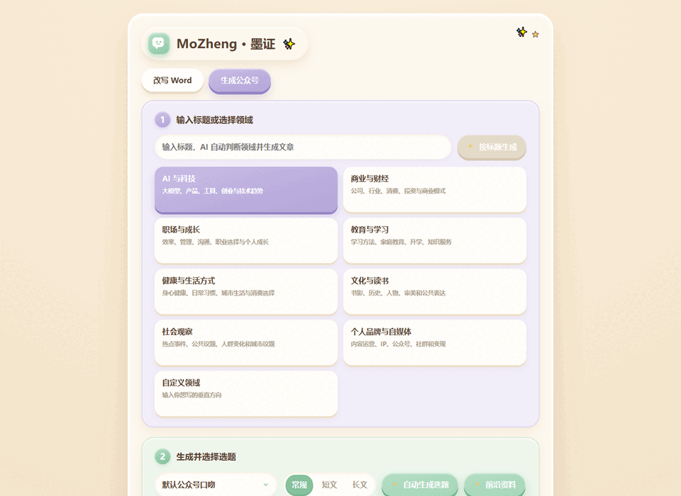

<div align="center">

# Speak Plainly · 说人话

**Write like a human, not a bot.**

An open-source writing workbench that strips the "AI smell" out of your drafts and generates evidence-backed articles — in **English or Chinese**.

[](LICENSE)


English · [中文](README.zh.md)

</div>

---

Speak Plainly rewrites Word documents to read more naturally, and generates full articles from a domain or a title — pulling in arXiv papers, RSS news, and public web sources to back the text with citations, images, tables, and an evidence chain. The whole UI and the generated content can switch between **English** and **Chinese**.

It is not "yet another prompt wrapper." The goal is to break content production into checkable steps — topic, sources, claims, paragraphs, images, tables, citations, export — leaving a source and an edit handle at each step.

## Screenshots

<table>
<tr>
<td width="50%" align="center">
<br/>
<sub><b>De-AI rewrite for Word</b></sub>
</td>
<td width="50%" align="center">
<br/>
<sub><b>Article generation with live sources</b></sub>
</td>
</tr>
</table>

## What it's good for

- Turn an AI first draft into text that reads like a real person wrote it.
- Upload a `.docx` and rewrite the whole thing in a built-in style or against your own samples.
- Click any sentence to get alternative phrasings, then fine-tune by hand.
- Auto-generate article topics by domain.
- Type a title and let the AI pick the domain and write the piece.
- Aggregate arXiv, news RSS, tech media, and web images as writing material.
- Produce articles with images, tables, references, and source notes.
- Export a fresh Word document and continue editing or publishing.

## Highlights

| Capability | What it does |
| --- | --- |
| De-AI rewrite | Restyles Word body text, cutting slogan-like, templated, and vague phrasing. |
| Style learning | Pick a built-in style, or upload `.docx` / `.txt` samples to extract a style profile. |
| Sentence-level editing | After generating or rewriting, click a sentence for alternatives or edit directly. |
| Topic planning | Generate topics by domain — AI & tech, business, careers, education, health, culture, society, creators. |
| Title-first flow | Enter only a title; the backend infers the domain, then runs the same research + generation chain. |
| Live research | Aggregates arXiv and RSS/Atom sources with dedup, truncation, caching, and safe context wrapping. |
| Figures & citations | Generated articles include structured body text, source images, an evidence table, and references. |
| Word export | Rewrites preserve original structure; generated articles export to `.docx`. |
| Bilingual | UI and generated content switch between English and Chinese. |

## Workflow

```text
Enter a title or pick a domain
        ↓
AI infers domain / auto-generates topics
        ↓
Search arXiv, RSS, news, and public web images
        ↓
Generate body, figures, tables, citations, references
        ↓
Structured preview + sentence-level editing in the web app
        ↓
Export to Word
```

Word rewrite chain:

```text
Upload Word + optional samples
        ↓
Parse docx paragraphs and headings
        ↓
Extract a style profile
        ↓
Whole-doc rewrite / sentence alternatives / title alternatives
        ↓
Replace only changed paragraphs and export Word
```

## Tech stack

| Layer | Tech |
| --- | --- |
| Frontend | React, Vite, TypeScript, Zustand |
| Backend | Node.js, TypeScript, Express |
| Documents | jszip for parsing and exporting `.docx` |
| Model API | OpenAI-compatible API, DeepSeek by default |
| Research | arXiv, RSS/Atom, public web metadata |
| Output | Paragraphs, images, tables, references, Word document |

## Project structure

```text
speak-plainly/
├── backend/
│   └── src/
│       ├── server.ts              # Express API routes
│       ├── prompts.ts             # Rewrite / topic / article prompts (EN + ZH)
│       ├── i18n.ts                # Backend language labels
│       ├── styles.ts              # Built-in style profiles
│       ├── services/
│       │   ├── article.ts         # Article generation, figures, tables, citations
│       │   ├── docx.ts            # Word parsing and export
│       │   ├── llm.ts             # Model calls
│       │   ├── rewrite.ts         # De-AI rewrite chain
│       │   └── research/          # arXiv, RSS, image extraction, cache, rate limit
│       └── scripts/               # Local test scripts
├── frontend/
│   └── src/
│       ├── App.tsx
│       ├── api.ts
│       ├── i18n.ts                # UI dictionary (EN + ZH)
│       ├── store.ts
│       └── components/
├── assets/screenshots/
└── README.md
```

## Quick start

Requires Node.js 18 or newer.

### 1. Configure the model key

Copy the example config and fill in your key:

```bash
cp backend/.env.example backend/.env
```

Windows PowerShell:

```powershell
Copy-Item backend/.env.example backend/.env
```

Example `backend/.env`:

```env
DEEPSEEK_API_KEY=your_deepseek_api_key
LLM_BASE_URL=https://api.deepseek.com
LLM_MODEL=deepseek-v4-pro
LLM_THINKING_TYPE=enabled
LLM_REASONING_EFFORT=high
PORT=8787
```

Or use the generic variables:

```env
LLM_API_KEY=your_openai_compatible_api_key
LLM_BASE_URL=https://api.deepseek.com
LLM_MODEL=deepseek-v4-pro
```

Precedence: `LLM_API_KEY` first, then `DEEPSEEK_API_KEY`.

Do not commit real API keys. `.env` is already in `.gitignore`.

### 2. Start the backend

```bash
cd backend
npm install
npm start
```

Default backend address: `http://localhost:8787`

### 3. Start the frontend

```bash
cd frontend
npm install
npm run dev
```

The frontend reaches the backend through a Vite proxy. To point at a different backend:

```bash
BACKEND_URL=http://localhost:8787 npm run dev
```

Windows PowerShell:

```powershell
$env:BACKEND_URL="http://localhost:8787"
npm run dev
```

Use the **EN / 中文** toggle in the top-right to switch language; the choice is remembered and also drives the language of generated content.

## Usage

### Rewrite Word

1. Open **Rewrite Word**.
2. Upload the `.docx` to rewrite.
3. Pick a built-in style or upload samples.
4. Upload and parse.
5. Polish the whole doc, or open the editor for sentence-level alternatives.
6. Review, then export Word.

### Generate an article

1. Open **Generate article**.
2. Enter a title directly, or pick a domain and auto-generate topics.
3. The system searches papers, news, and public web sources.
4. Review the body, images, tables, and references.
5. Keep tuning sentence by sentence in the editor.
6. Export Word.

## API overview

| Method | Path | Description |
| --- | --- | --- |
| `GET` | `/api/health` | Check model connectivity |
| `GET` | `/api/styles?lang=` | Built-in writing styles |
| `POST` | `/api/upload` | Upload Word + samples |
| `POST` | `/api/rewrite` | Whole-doc de-AI rewrite |
| `POST` | `/api/title` | Title alternatives from full text |
| `POST` | `/api/sentence/alternatives` | Sentence alternatives |
| `POST` | `/api/export` | Export Word |
| `GET` | `/api/article/domains?lang=` | Article domains |
| `POST` | `/api/article/topics` | Topics by domain |
| `POST` | `/api/article/generate` | Article from a topic |
| `POST` | `/api/article/generate-from-title` | Article from a title (auto domain) |
| `POST` | `/api/research/preview` | Preview aggregated research |

All content endpoints accept a `lang` field (`"en"` or `"zh"`) to control the language of generated output.

## Test & build

Backend:

```bash
cd backend
npm run test:docx
npm run test:article
npm run test:research
npm run build
```

Frontend:

```bash
cd frontend
npm run build
```

Model connectivity test (needs a valid API key):

```bash
cd backend
npm run test:llm
```

## Sources

Speak Plainly currently supports:

- **arXiv** — open paper entries and abstracts.
- **RSS/Atom** — public news, tech, finance, and Chinese-language feeds.
- **Public web metadata** — prefers `og:image` / `twitter:image` from source pages.

Note: RSS, image, and reuse rules differ per outlet. The project only aggregates technically; it does not grant reuse rights. Before publishing, verify sources, copyright, facts, and citation format by hand.

## Content quality principles

When generating articles, the prompts push for:

- No AI filler phrases.
- No vague transitions padding length.
- Every claim tied to data, sources, or explicit references.
- Clear paragraph-to-paragraph progression.
- Images preferred from cited sources, shown with caption and source.
- Reference formatting close to academic style.

The model can still be wrong. High-stakes, factual, financial, medical, and legal content must be reviewed by a human.

## Limitations

- Output quality depends on the model and live-source quality; human review is needed.
- RSS availability varies; some sites lack a stable public feed.
- Word export preserves structure, but in-paragraph character-level formatting of rewritten paragraphs may not fully round-trip.
- Documents live in backend memory and are lost on restart.
- A public deployment needs auth, rate limiting, persistent storage, and stricter upload limits.

## Roadmap

- Result-page screenshots and a demo GIF.
- Docker Compose.
- Cover images and card/long-image export.
- Upload a personal source library and generate from it.
- Source-credibility scoring and citation templates.
- Per-user history and draft management.

## Contributing

Issues and pull requests are welcome. Keep PRs small and describe:

- The goal of the change
- The main approach
- Tests run
- Modules that might be affected

## License

Released under the [MIT License](LICENSE) — free to use, modify, and build on, as long as the copyright and license notice are kept.
