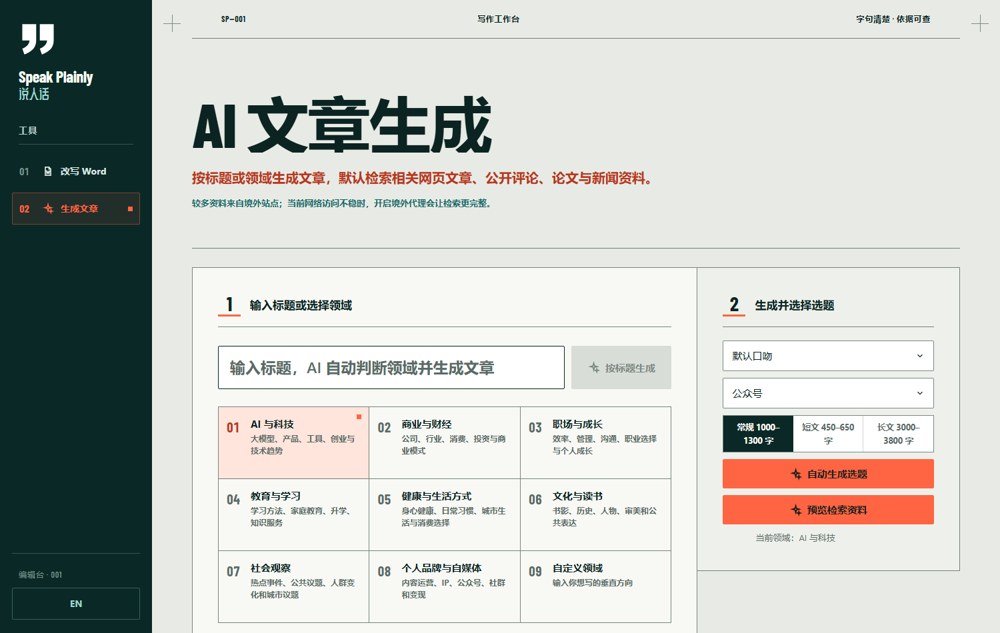

<div align="center">

# Speak Plainly · 说人话

**Turn AI-shaped drafts into writing that reads like a person wrote it.**

Open-source AI writing workbench for **Word rewriting**, **human-likeness scoring**, **source-backed article generation**, and **WeChat Official Account formatting**. It works in English and Chinese.

[](LICENSE)


[中文说明](README.zh.md)

</div>

---

## At A Glance

| Rewrite Word | Generate Articles | WeChat Formatting |
| --- | --- | --- |
|  |  |  |

<div align="center">
  <sub>A light SaaS-style workspace: Word rewriting, source-backed article generation, and WeChat-ready formatting behind one sidebar.</sub>
</div>

## What It Does

- **Rewrite a `.docx` draft** and export it back to Word.
- **Score how human the text feels** with a local 0-100 human-likeness score.
- **Click any sentence** to get alternatives or edit it by hand.
- **Learn your style** from uploaded `.docx` or `.txt` samples.
- **Show progress while the model works** for article writing, whole-document rewriting, title options, and topic generation.
- **Generate an article from a title or domain** with arXiv papers, RSS news sources, and optional Agent-Reach / Exa web search.
- **Format articles for the WeChat Official Account editor** with six built-in visual themes, keyword underlining, and a deterministic compliance check — paste the result straight into 公众号.
- **Run privately** with any OpenAI-compatible endpoint, including local model servers.

## Basic Environment

You need:

| Tool | Why |
| --- | --- |
| Node.js 18+ | Runs the frontend and backend |
| npm | Installs project packages |
| A model API key | DeepSeek/OpenAI-compatible by default |
| Or a local model server | Ollama, LM Studio, vLLM, etc. |
| `.docx` files | Required for Word rewrite mode |

Optional but useful: Git Bash on Windows if you want to run `./run.sh`.

Optional for broader live research: [Agent-Reach](https://github.com/Panniantong/Agent-Reach) with a working `mcporter` command and Exa backend. Social sources such as Reddit and X/Twitter are not enabled by default because they usually need logged-in cookies or separate CLI setup.

## Quick Start

Use one terminal:

```bash
./run.sh
```

On Windows you can also double-click or run:

```bat
run.bat
```

The script checks basic dependencies, prepares `backend/.env` on first run, installs packages, clears the same service port before starting, and opens one frontend/backend session.

Stop the services:

```bash
./stop.sh
```

```bat
stop.bat
```

Manual start:

```bash
cp backend/.env.example backend/.env
cd backend
npm install
npm start
```

```bash
cd frontend
npm install
npm run dev
```

Backend: `http://localhost:8787`  
Frontend: Vite will print the local URL, normally `http://localhost:5173`

## Interface

The current UI is a light SaaS-style workspace: a white sidebar for tool navigation and language switching, a pastel aurora backdrop, a gradient hero headline, white rounded cards for each step, and violet gradient primary actions. The goal is a focused writing workspace that feels like a modern web tool rather than a decorative skin.

Long-running actions never leave the user waiting without feedback. The frontend shows a progress panel with percentage, current phase, and recent log-style steps for article generation, topic/title generation, and whole-document rewriting.

## Human-Likeness Score

Higher is better.

```text
human-likeness score = round(length_confidence * (100 - total_penalty))
total_penalty = min(100, sum(capped category penalties))
```

The score is fully local. It does not call a model or upload your text.

The scorer normalizes evidence by text length: one unit is **120 Chinese characters** or **100 English words**. Very short text has lower confidence: empty text scores 0; text under 40 Chinese characters or 25 English words uses `length_confidence = 0.65`.

| Signal | Max deduction | What it catches |
| --- | ---: | --- |
| Boilerplate opener/closer | 26 | Stock endings like “in conclusion” / “总而言之” |
| Empty filler | 22 | Correct but hollow phrases |
| AI buzzwords | 18-20 | Overused model-style vocabulary |
| Model catchphrases | 18 | Viral/content-farm phrasing such as “接住”, “更狠一点”, “直接拉满” in Chinese output |
| Mechanical connectives | 18 | Repeated sentence-start transitions |
| Generic frames | 14 | Formulaic “the key is...” structures |
| Parallelism | 14-16 | Too-neat paired sentence patterns |
| Leaked Markdown | 20 | `##`, bullets, bold markers left in prose |
| Uniform sentence length | 12 | Sentences that are suspiciously even |
| Repeated wording | 10 | Excess repeated non-trivial words/phrases |
| Few concrete anchors | 8 | Not enough numbers, names, citations, or quoted specifics |

The rewrite prompt also applies a creator workflow: humanize the prose first, keep concrete evidence from the source material, preserve names/numbers/dates, and add specific scene-level detail only when the original supports it.

| Score | Meaning |
| --- | --- |
| 70-100 | Reads human |
| 40-69 | Getting natural |
| 0-39 | Needs a human pass |

## Live Sources

Article generation can collect live context from arXiv, RSS feeds, and optional Agent-Reach / Exa web search. Slow, blocked, or missing sources are recorded as unavailable instead of breaking the whole article.

Current enabled RSS sources include NPR World, France 24, CNBC World, UN News, TechCrunch, Ars Technica, Wired, MIT Technology Review, Engadget, Hacker News via HNRSS, CNBC Top News, MarketWatch, and 36Kr.

The Agent-Reach integration currently uses its Exa/mcporter search path as a broad web source. Reddit, X/Twitter, Xiaohongshu, and similar logged-in social channels require credentials/cookies and are intentionally not switched on automatically.

## WeChat Formatting (公众号排版)

The third sidebar tool turns a Markdown (or plain-text) article into HTML that survives pasting into the WeChat Official Account editor: inline styles only, every text node wrapped in `<span leaf="">`, no `<div>`/`class`/`id`, full-width punctuation in prose.

- **Six themes** from [gzh-design-skill](https://github.com/isjiamu/gzh-design-skill): 摸鱼绿, 红白色系, 石墨极简风, 留白禅意风, 摸鱼票据风, 橄榄手记. Each theme is a component library (cover, chapter titles, quote cards, signature) that the model assembles per chapter.
- **Import in one click** from the Rewrite or Generate workspaces, or paste any Markdown.
- **Compliance validation** is deterministic (ported from the skill's Python validator): forbidden tags/styles are errors, unwrapped text and half-width punctuation are warnings, and failing chunks get one automatic repair pass.
- **Copy or download**: a live preview renders the exact rich text; “复制到公众号” copies it for direct pasting, and the HTML download is a standalone preview page with its own copy button.

## Private Local Mode

Point the backend at a local OpenAI-compatible server:

```env
LLM_BASE_URL=http://localhost:11434/v1
LLM_API_KEY=ollama
LLM_MODEL=qwen2.5:14b
LLM_THINKING_TYPE=off
LLM_REASONING_EFFORT=off
```

## Useful Commands

```bash
cd backend
npm run build
npm run test:research
npm run test:score
```

```bash
cd frontend
npm run build
npm run test:progress
```

## Project Map

```text
backend/
  src/routes/      API endpoints
  src/services/    rewrite, article, docx, score, research, gzh formatting
  src/prompts/     model prompts
  assets/gzh/      WeChat theme component libraries (from gzh-design-skill)

frontend/
  src/components/  upload, generate, gzh, editor, common UI
  src/lib/         API client, store, i18n
  src/styles.css   light workspace theme (sidebar, hero, cards)

assets/screenshots/  README screenshots
docs/                design notes
```

## Notes

- Generated articles still need human fact-checking.
- Live sources can change or go offline.
- Documents are stored in backend memory and disappear after restart.
- Public deployment should add authentication, rate limits, and persistent storage.

## License

[MIT](LICENSE) for this project's own code.

The WeChat formatting feature integrates theme component libraries and validation rules from [gzh-design-skill](https://github.com/isjiamu/gzh-design-skill) by 甲木 (Jiamu) × 摸鱼小李 (Moyu Xiaoli), which is licensed under **AGPL-3.0** (see `backend/assets/gzh/LICENSE`). If you redistribute this project or offer it as a public network service with that feature included, review the AGPL-3.0 obligations first.
